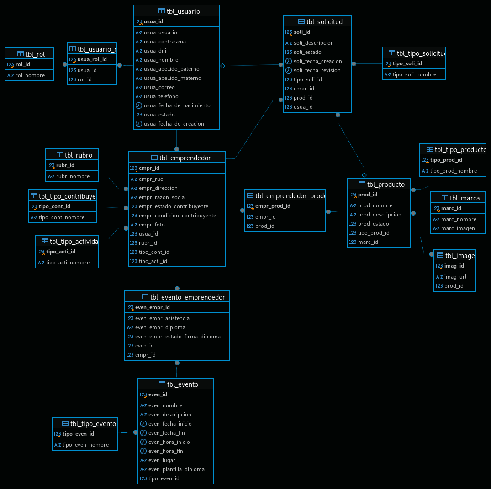

# Sistema de promociones empresariales



## Requerimientos

- JDK 17
- Wildfly 34
- Git
- Docker

Clonar o descargar el repositorio usando `git`

```console
git clone git@github.com:danielscf/promocion-empresarial.git
```

> Para obtener actualizaciones del repositorio usar `git pull` y para subir actualizaciones `git push`

El proyecto de **spring-boot** cuenta con integración a **docker-compose**. Opcionalmente se pueden arrancar los servicios mediante la interfaz de **intellij**. De otro modo se levanta el servicio de frontend y la base de datos usando

```console
docker compose up -d
```

Para detener los servicios usar

```console
docker compose down -v
```
