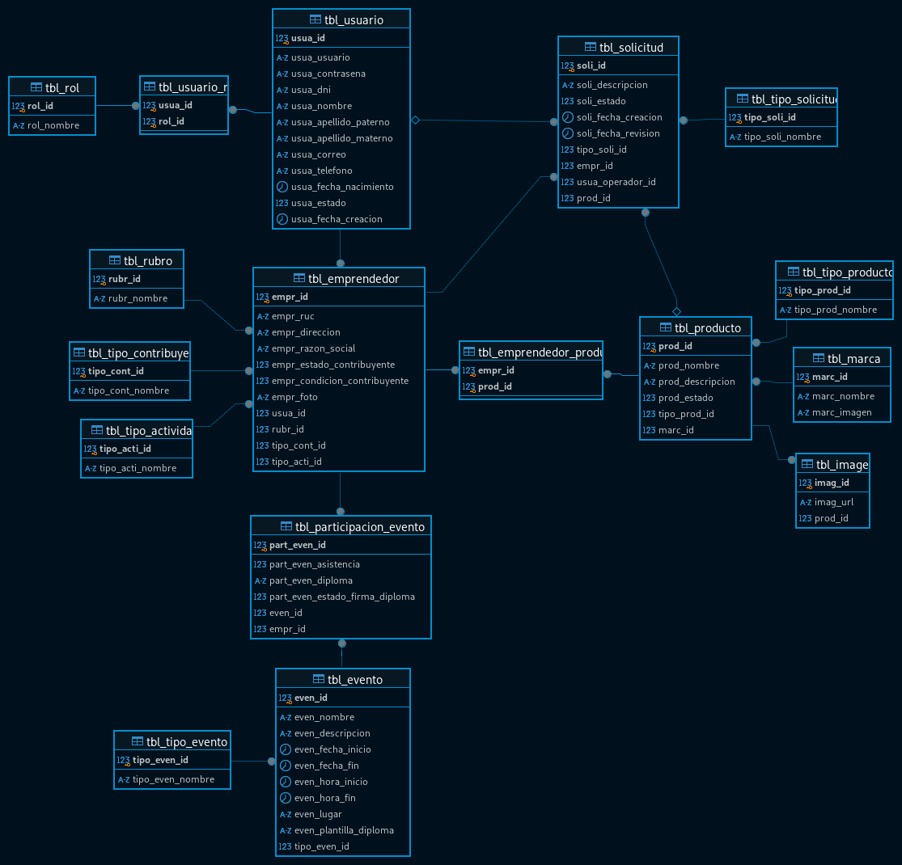

# Sistema de promociones empresariales



## Requerimientos

- JDK 17
- Wildfly 34
- Git
- Docker

Clonar o descargar el repositorio usando `git`

```console
git clone git@github.com:danielscf/promocion-empresarial.git
```

> Para obtener actualizaciones del repositorio usar `git pull` y para subir actualizaciones `git push`

El proyecto de **spring-boot** cuenta con integración a **docker-compose**. Arrancar solo usando **intellij**
